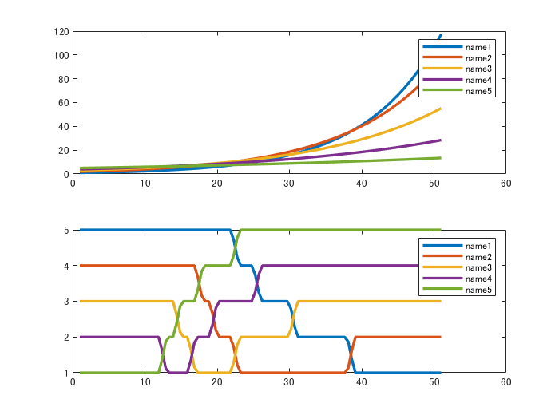

# Bar Chart Race Plot


Copyright (c) 2020 Michio Inoue


This repository provides a function that generates a bar chart race plot.


### Requirements: R2019b


  
## **Syntax**


`barChartRace(X)` draws the animation of the bar chart for each rows of `X`. `X` can be numeric array, table, or timetable.


`h1 = barChartRace(X)` returns a handle (`h1`) to the figure with bar chart.


`[h1,h2] = barChartRace(X)` returns a handle (`h2`) to the figure with the data description in addition to `h1`.


`[ __ ] = barChartRace(X, Name, Value)` to use some Name-Value Pair Arguments.


  
## **Name-Value Pair Arguments**


**'Time': **A vector (numeric or datetime) that represents the time for each raw of X. The  default is 1:size(inputs,1)


**'LabelNames': ** A cell or string vector of the variable names, each element corresponds to each columns of `X`. The default is `"name" + string(1:size(X,2))` if `X` is a numeric array or the name of varialbes if `X` is a table or timetable.


**'ColorGroups':** A cell or string vector of color group name. Each element corresponds to each columns of X. The default is `"name" + string(1:size(X,2))` if `X` is a numeric array or the name of varialbes if `X` is a table or timetable. Example: With `'ColorGroups' = ['g1','g1','g2','g1','g2']`, the bars of 1st, 2nd, 4th column of inputs will the same color. The default color order will be used.


**'NumInterp':** A number of datapoints to be generated between each time stamp of X. The larger the value is the smoother/slower the transtion. The default is 2.


**'Method':** A method for above interpolation. The default is 'linear', but can be 'spline' for more dynamic bar transition.


**'GenerateGIF':** If TRUE, GIF animation of bar chart race will be generated.


**'Outputfilename':** Output GIF file name


**'XlabelName':** The XLabelName, the defaultis "" (emtpy)


**'IsInteger': **If TRUE, the text shown next to each bar will be arounded to interger value. The default is TRUE.


**'Position':** The positin of the figure (1x4). The deafult is 'DefaultFigurePosition'.


  
# Example: 


See `barChartRace.m` for the detail options.


Here's a toy data set and its transition of rankings. The variable A starts from 5th place and move to 1st place in the end.


```matlab
addpath(".\function");

% Some toy (time series) data set
maxT = 45;
time = 0:50;
x0 = 1:5; % initial data
rate = (5:-1:1)/100*2; % growth rate
data = zeros(length(time),length(x0));
data(1,:) = x0;
for ii=2:length(time)
    data(ii,:) = data(ii-1,:).*(1+rate);
end
barChartRace(data);
```




  
# Scripts


There are also some sample scripts which will generate a bar chart race plot. These can be a good example to work through the basic ideas behind the bar chart race animation with graphics object of MATLAB. These script can work with the earlier version of MATLAB.


   -  `barChartRace_UniColor.m`: Single color version 
   -  `barChartRace_multiColor_oneBar.m`: Multi-color version with one bar object. 
   -  `barChartRace_multiColor_multiBar.m`: Multi0color version with multi-bar objects (for users with R2017a or earlier.) 


Note: The implementation of a function `barChartRace` is similar to that of `barChartRace_multiColor_oneBar.m` but many additional options.


