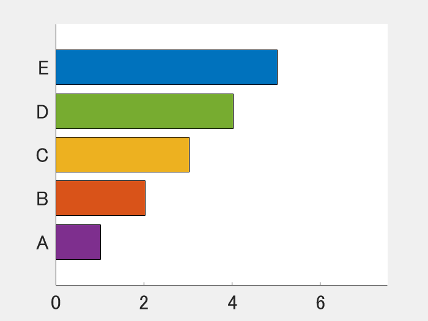
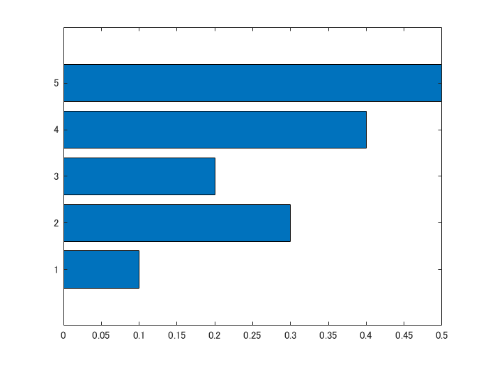
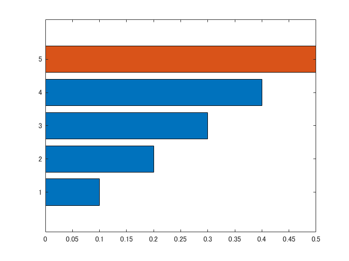

# Bar Chart Race in MATLAB: getting started with `barh`


`Copyright (c) 2020 Michio Inoue`


# はじめに
  


最近よくみるこんなプロット：各データの時系列変化を順位とともに表現するプロットです。時間とともに順位が入れ替わるので Bar Chart Race とか呼ばれている（？）ようで、検索するといろんなデータの可視化がみられます。


これを MATLAB で書けないのか、、という声が答えてきた気がしましたので、やってみました。


今回は準備編として描画に必要な要素がそろっているかの確認をします。 `barh` 関数の機能を確認してみましょう。





# 横棒グラフのプロット


まずは棒グラフ `barh` を書いてみます。


```matlab
clear; close all
x = 1:5;
y = (1:5)/10;
handle_bar = barh(x,y);
```


簡単ですね。x が縦の位置、y が棒の長さを決めます。


`barh` がややこしいのは `x` が縦軸上での位置、`y `が対応する棒の長さである点。直感的に `x` と `y` が逆転しているように感じる点。


# 棒グラフの棒の位置を指定（整数）


プロパティを見てみます。


```matlab
handle_bar
```
```
handle_bar = 
  Bar のプロパティ:

    BarLayout: 'grouped'
     BarWidth: 0.8000
    FaceColor: [0 0.4470 0.7410]
    EdgeColor: [0 0 0]
    BaseValue: 0
        XData: [1 2 3 4 5]
        YData: [0.1000 0.2000 0.3000 0.4000 0.5000]

  すべてのプロパティ を表示

```


棒グラフの位置（縦方向）は `XData` プロパティで変更できそうです。例えば 2 と 3 を入れ替えてみます。


```matlab
handle_bar.XData = [1,3,2,4,5];
```




3 と 2 の位置が逆転しました。


# 棒グラフの棒の位置を指定（小数点）


小数点（不均等な位置指定）もできれば、順位が入れ替わる遷移を表現できそうな気がします。


2 を 2.8 に 3 を 2.2 にして、すれ違った後を表現してみます。


```matlab
handle_bar.XData = [1,2.8,2.2,4,5];
```


## ちょっと違う


位置が変わったのはいいが何かがおかしい。棒の幅が細い！ 


これは `barh `関数が気を利かせてくれて、それぞれの棒が重ならないように描画するためです。ま、気持ちはわからんでもない。


ここを打開するには `BarWidth` プロパティです。既定値は `0.8` であり、MATLAB で少し間隔を空けて各バーが表示されます。このプロパティを `1` に設定すると、バー同士が隙間なく表示されます。参照：[Bar のプロパティ](https://www.mathworks.com/help/matlab/ref/matlab.graphics.chart.primitive.bar-properties.html)


```matlab
handle_bar.BarWidth
```
```
ans = 0.8000
```
# `BarWidth` プロパティ


ではこれをいくつにすればいいのか。間隔がちょうど１だった時には 0.8 でいい感じの表示でした。


では直感的にデータの幅に反比例するように `BarWidth` の値を大きくすればいいのでは？


やってみます。現時点では


```matlab
tmp = handle_bar.XData
```
```
tmp = 1x5    
    1.0000    2.8000    2.2000    4.0000    5.0000

```


という位置関係なので、最も近い位置にある棒同士の距離を使って計算してみましょう。


```matlab
scaleWidth = min(diff(sort(tmp)))
```
```
scaleWidth = 0.6000
```


`一度 sort` しているのは、逆転してるからです。この値を使って `BarWidth` の値を既定値の 0.8 のような見栄えになるように変えてみます。


```matlab
handle_bar.BarWidth = 0.8/scaleWidth;
```


おぉ、できたっぽい。


これで、y 軸の位置をランキング（順位）に該当するように `XData` プロパティを変更すればいいですね。ぬめぬめ遷移させるには、ランキングの入れ替え部分を内挿してちょっとずつ順位が入れ替わるようにすれば、ぬめぬめ遷移が表現できそうな気がしてきました！


# 軸などの表示


y 軸に少数点が表れているのが気になりますので、この辺綺麗にしてみましょう。


使うのは `Axes` オブジェクトの `YTick` と `YTickLabel` です。それぞれの棒のラベルは 


```matlab
names = ["A","B","C","D","E"];
```


とします。まずはラベルを表示する位置 `YTick` を指定します。ランキング（位置）に相当する `XData` プロパティ値をそのまま入れてみます。 


```matlab
handle_axes = gca;
```
```matlab
try
    handle_axes.YTick = handle_bar.XData;
catch ME
    disp(ME.message)
end
```
```
値は単精度型または倍精度型のベクトルで、値が増加しなければなりません
```
# YTick は単調増加じゃないと


エラーがでました。`YTick` には**単調増加**した値を与えないとエラーがでます。ソートしておきましょう。(小さい順)


```matlab
[tmp,idx] = sort(handle_bar.XData,'ascend');
```


`XData` の並べ替えに応じて `names` の順番も変えておく必要があるので、第二出力引数の `idx` も使います。


```matlab
handle_axes.YTick = tmp;
handle_axes.YTickLabel = names(idx);
```


B と C が入れ替わっている感じがでてますね！


# 残念な点：色の問題


`barh` の残念な点なんですが、1 つの bar オブジェクトに対して色は1色しか指定できません。


なので、色の種類だけ `barh` を実行して異なる bar オブジェクトを作ればればいいですね。


```matlab
figure
x = 1:5;
y1 = [1:4,0]/10;
y2 = [0,0,0,0,5]/10;
handle_bar1 = barh(x,y1);
hold on
handle_bar2 = barh(x,y2);
hold off
```



# まとめ


準備編はここまで！色の数だけ bar オブジェクトを作るといろいろ大変そうですが、むしろいろいろ自由にカスタマイズできていいかもしれない。


できそうな気がしてきました。次はサンプルデータを使ってランキングが推移するアニメーションを書いてみます。


やることは以下の2点


   -  複数の時系列データの各時点での値の順位付け 
   -  順位が入れ替わる遷移部分を表示するためのデータの内挿 


これができれば、あとは bar オブジェクトに値を入れていくだけです。


