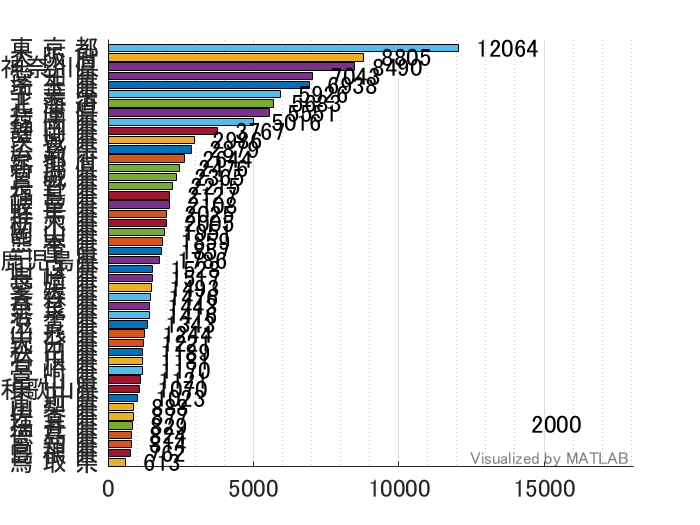
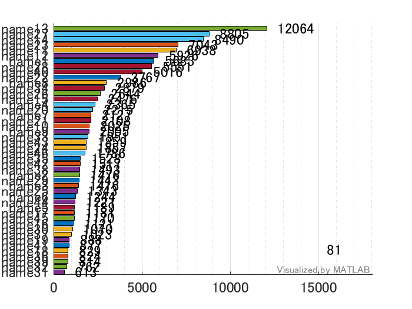

# 各都道府県の推定人口推移（大正9年〜平成12年）


Copyright (c) 2020 Michio Inoue


まず [e-Stat](https://www.e-stat.go.jp/stat-search/files?page=1&layout=datalist&toukei=00200524&tstat=000000090001&cycle=0&tclass1=000000090004&tclass2=000000090005&stat_infid=000000090265) のページからデータをダウンロードします。


`05k5-5.xlsx` というファイルが本スクリプトと同じフォルダにダウンロードされたと仮定します。


```matlab
addpath("../../function")
```
# データ読み込み


ザクっとインポートツールから読み込むスクリプトを作りました。変数 `k55` として読み込まれるはず。


```matlab
importData
```
# データ整理


時系列データは `timetable` 型が便利なのでこちらでまとめてみます。


注：沖縄はデータが大きく欠けているところがあるので除いています。


```matlab
% k55 から必要な部分を取り出します。
years = [k55{1,3:end}]'; % 年数
names = string(k55(4:end-1,1)); % 都道府県の名前
data = cell2mat(k55(4:end-1,3:end)); % 人口（数値部分）

% 年データを datetime 型に変更
timeStamp = datetime(years,1,1);
timeStamp.Format = 'yyyy'; % 表示は yyyy年

% timetable 型のデータ作成
T = array2timetable(data','RowTimes',timeStamp);
T.Properties.VariableNames = names; % 変数名指定
```
# プロット描画
```matlab
barChartRace(T);
```




全データプロットすると何が何だか分かりませんね。


## 各オプションの解説（一部）


詳細は


```matlab
help barChartRace
```


で表示するか、README.md で確認ください。


```matlab
barChartRace(T,'NumDisplay',15,'NumInterp',4,...
    'Position',[ 500 60 470 470],'ColorGroups',repmat("g",length(names),1),...
    'XlabelName',"上位15都道府県の人口（千人）",'GenerateGIF',false);
```


使用したオプションの意味は以下：


   -  NumDisplay: 上位何位まで表示するか。既定値は全データ表示です。 
   -  NumInterp: データの内挿点数。数が多い程滑らかに推移します。既定値は 2。 
   -  Position: 作成される Figure の大きさ。 
   -  ColorGroups: 色分けの指定。文字列は何でも良いですが、同じ文字＝同じ色で描きます。既定値はすべてのバーを 7 色で分けます。 
   -  XlabelName: x軸の名前。既定値は空（何も表示しません） 
   -  GenerateGIF: `true` で gif ファイル生成します。既定値は `false` です。 

# 入力が数値配列のケース


`barChartRace` 関数は数値データ（2次元配列）も受け付けます。縦方向が時間変化


```matlab
data = T.Variables;
```


で数値部分だけ取り出した変数を使ってみます。


```matlab
data = T.Variables;
barChartRace(data);
```




変数の名前は適当に name(数値) で描かれます。時間情報が無いので左下もただの数値（何番目のデータか）になっています。オプションを使ってみます。


## 各オプションの解説（一部）
```matlab
barChartRace(data,'NumDisplay',15,'LabelNames',names,...
    'Position',[500 60 470 470],'ColorGroups',repmat("g",length(names),1),...
    'XlabelName',"上位15都道府県の人口（千人）",'GenerateGIF',false);
```


   -  LabelNames: `timetable` 型または `table` 型変数の場合は変数の名前をそのまま使いますが、このオプションで指定することも可能です。 
   -  Position: 作成される Figure の大きさ。 
   -  ColorGroups: 色分けの指定。文字列は何でも良いですが、同じ文字＝同じ色で描きます。 
   -  XlabelName: x軸の名前。 
   -  GenerateGIF: `true` で gif ファイル生成します。既定では `false` です。 

